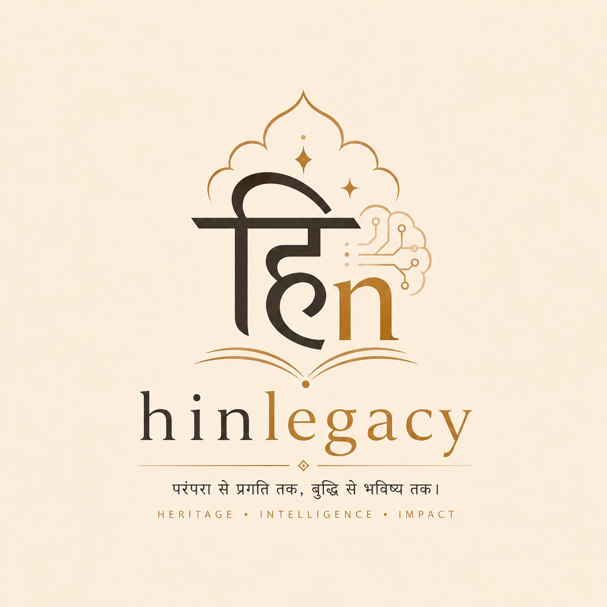

<p align="center">
  
</p>

<h1 align="center">HinLegacy</h1>

<p align="center">
  <strong>Detect, decode, and encode legacy Hindi font text for modern AI, archival, and document-processing pipelines.</strong>
</p>

<p align="center">
  Walkman Chanakya 905 · KrutiDev 010 · DevLys 010
</p>

---

## Overview

A large amount of Hindi content across institutions, offices, schools, publishers, archived records, and long-running desktop publishing workflows still exists in legacy font encodings such as KrutiDev, DevLys, and Chanakya.

These documents may appear visually correct on screen, but internally they are often stored as font-dependent glyph sequences instead of proper Unicode Devanagari text.

That creates a serious problem in the modern text-processing stack.

Search, indexing, embeddings, semantic retrieval, NLP pipelines, entity extraction, RAG systems, and LLM-based processing all work best when the underlying text is valid Unicode. Legacy Hindi encodings break that assumption and make otherwise valuable document collections hard to search, reuse, normalize, or understand programmatically.

OCR is often the right tool for scanned images and paper-first archives. But when the source is already digital text in a legacy encoding, OCR can add unnecessary compute cost, introduce avoidable recognition errors, and reduce pipeline reliability.

**HinLegacy** is built for that gap.

Instead of treating legacy Hindi text as an image problem, HinLegacy treats it as an encoding-conversion problem.

---

## Why HinLegacy

HinLegacy helps modern systems work with old Hindi text by providing:

- 🔍 Font detection for supported legacy Hindi encodings
- 🔁 Direct decoding from legacy font text to Unicode Devanagari
- 📝 Encoding from Unicode back into supported legacy fonts
- ⚙️ A Python API for integration into applications and pipelines
- 💻 A CLI for direct terminal usage
- 🧠 A practical bridge between legacy Hindi documents and AI-era processing systems

This makes it useful for:

- RAG pipelines over Hindi archives
- Government and educational document modernization
- Search indexing over legacy corpora
- Vector database ingestion
- Hindi NLP preprocessing
- ETL and document cleanup workflows
- Internal tooling for archive migration

---

## Supported Fonts

HinLegacy currently supports:

- Walkman Chanakya 905
- KrutiDev 010
- DevLys 010

---

## Installation

### Install from PyPI

```bash
pip install hinlegacy
```

### Install for local development

```bash
git clone https://github.com/satvikmishra44/hinlegacy.git
cd hinlegacy
pip install -e .
```

---

## Quick Start

### Python API

```python
from hinlegacy import detect, decode, encode, convert

legacy_text = "your legacy text here"

result = detect(legacy_text)
print(result.font_slug)
print(result.confidence)
print(result.method)

unicode_text = decode(legacy_text, "krutidev_010")
print(unicode_text)

encoded_text = encode("भारत", "devlys_010")
print(encoded_text)

converted = convert(legacy_text)
print(converted.unicode_text)
print(converted.detected_font)
print(converted.confidence)
print(converted.detection_method)
```

### CLI

```bash
hinlegacy detect "legacy text here"
hinlegacy decode "legacy text here" --font krutidev_010
hinlegacy encode "भारत" --font devlys_010
hinlegacy convert "legacy text here"
hinlegacy list-fonts
```

---

## CLI Commands

### Detect the font

```bash
hinlegacy detect "legacy text here"
```

Output includes:
- detected font slug
- confidence score
- detection method

### Decode legacy text into Unicode

```bash
hinlegacy decode "legacy text here" --font krutidev_010
```

### Encode Unicode text into a legacy font

```bash
hinlegacy encode "भारत एक सुंदर देश है" --font walkman_chanakya_905
```

### Convert with auto-detection

```bash
hinlegacy convert "legacy text here"
```

### List supported fonts

```bash
hinlegacy list-fonts
```

---

## Python API Reference

### `detect(text: str) -> DetectionResult`

Detects which supported legacy Hindi font is used in the given text.

### `decode(text: str, font: str) -> str`

Decodes legacy Hindi text into Unicode Devanagari using the specified font.

### `encode(text: str, font: str) -> str`

Encodes Unicode Hindi text into the specified legacy font.

### `convert(text: str, font: str | None = None) -> ConversionResult`

Converts legacy Hindi text into Unicode.

If `font` is provided, HinLegacy decodes directly using that font.

If `font` is omitted, HinLegacy first detects the font and then decodes it.

---

## Result Models

### `DetectionResult`

```python
@dataclass
class DetectionResult:
    font_slug: str
    confidence: float
    method: str
```

### `ConversionResult`

```python
@dataclass
class ConversionResult:
    unicode_text: str
    detected_font: str
    confidence: float
    detection_method: str
```

---

## Example Workflows

### 1. Detect and decode legacy text

```python
from hinlegacy import convert

result = convert("legacy text here")
print(result.unicode_text)
print(result.detected_font)
```

### 2. Decode when the font is already known

```python
from hinlegacy import decode

text = decode("legacy text here", "devlys_010")
print(text)
```

### 3. Encode Unicode text for legacy-system compatibility

```python
from hinlegacy import encode

legacy_text = encode("कृपया नाम लिखिए", "krutidev_010")
print(legacy_text)
```

### 4. Use in a preprocessing pipeline

```python
from hinlegacy import convert

def normalize_legacy_hindi(text: str) -> str:
    result = convert(text)
    return result.unicode_text
```

---

## Use Cases

- 📚 Digitizing Hindi educational content
- 🏛️ Modernizing administrative and archival records
- 🔍 Making legacy Hindi corpora searchable
- 🧠 Preparing Hindi text for embeddings and retrieval
- 🗂️ Converting legacy text before RAG ingestion
- 🧪 Cleaning text for Hindi NLP pipelines
- 📄 Converting old DTP-generated content into reusable Unicode text

---

## Project Structure

```text
src/hinlegacy/
├── cli/
├── decoder/
├── detector/
├── api.py
├── models.py
├── exceptions.py
├── __init__.py
└── __main__.py
```

---

## Development

### Run tests

```bash
pytest -v
```

### Build the package

```bash
python -m build
```

### Check package metadata

```bash
python -m twine check dist/*
```

### Run the CLI locally

```bash
python -m hinlegacy --help
```

---

## Release Workflow

A typical release workflow looks like this:

```bash
pytest -v
python -m build
python -m twine check dist/*
```

Then test installation from the built artifacts:

```bash
pip install --force-reinstall dist/*.whl
```

And verify:

```bash
hinlegacy --help
hinlegacy list-fonts
```

---

## Limitations

- Detection is currently heuristic-based and may be less reliable on very short or ambiguous text samples.
- Unicode output may differ in some visually equivalent Hindi forms depending on normalization and font-specific mapping choices.
- OCR-based scanned image extraction is outside the scope of HinLegacy; the package is designed for machine-readable legacy text.

---

## Roadmap

- Improved detection heuristics using broader sample corpora
- File-based batch conversion
- Structured JSON CLI output
- Expanded evaluation suite
- Additional legacy Hindi font support
- Better normalization utilities for Unicode output comparison

---

## Contributing

Contributions are welcome, especially in:

- additional font support
- improved detection heuristics
- test corpus creation
- CLI enhancements
- documentation improvements
- OCR integrations

A good contribution workflow:

```bash
git clone https://github.com/satvikmishra44/hinlegacy.git
cd hinlegacy
pip install -e .
pytest -v
```

---

## License

MIT

Add the full MIT license text in the `LICENSE` file at the repository root.

---

## Vision

Legacy Hindi text is often not an OCR problem.

It is an encoding problem.

HinLegacy exists to help modern software systems understand, normalize, and unlock that text for the era of AI, search, retrieval, and reusable structured knowledge.